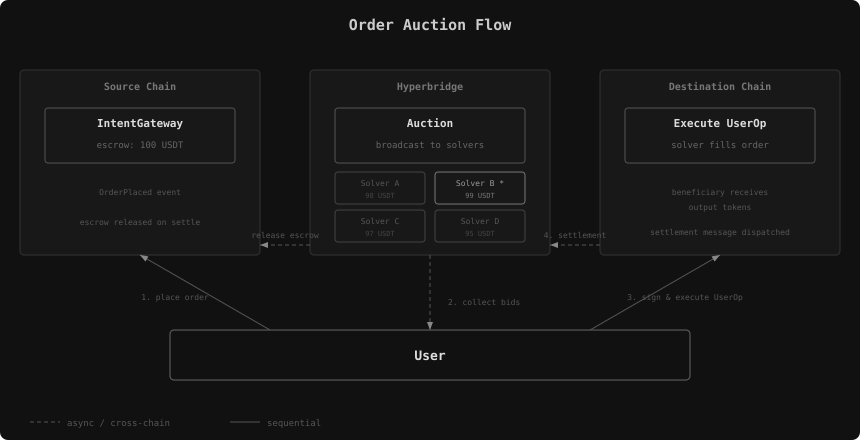
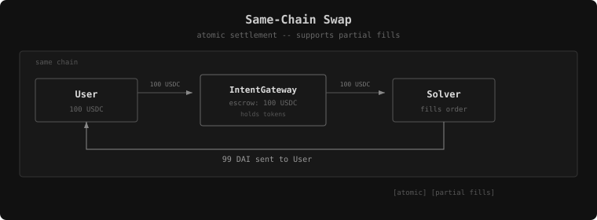
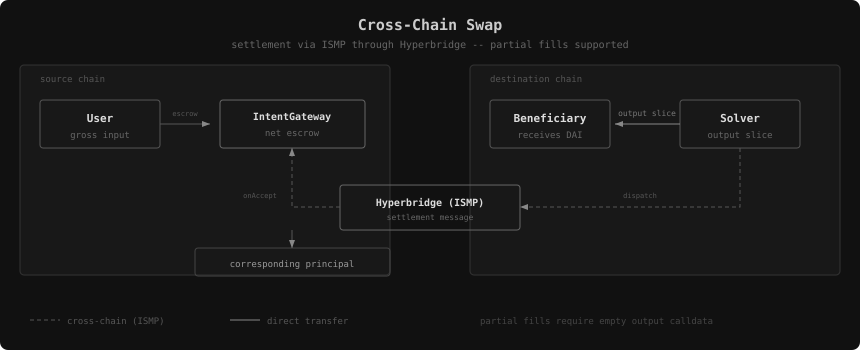
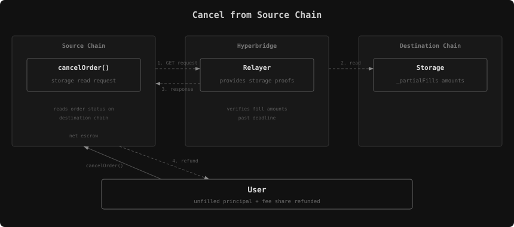
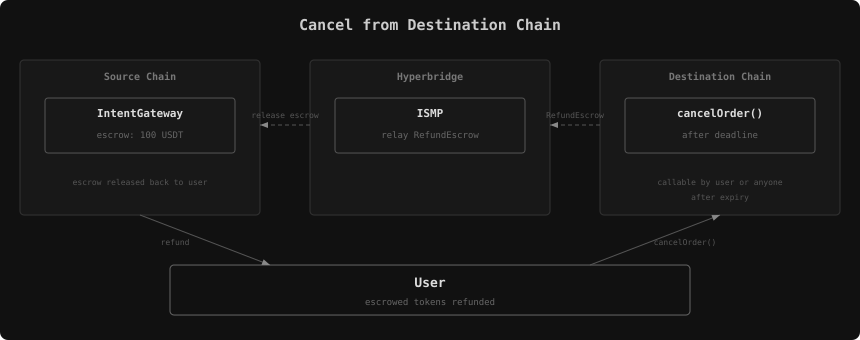

# Intent Gateway

The IntentGateway protocol enables intent-based token swaps across EVM chains connected by Hyperbridge. Users escrow tokens and declare desired outputs; solvers compete to fill orders and claim the escrowed inputs.

Each order is **auctioned** to competing solvers. Solvers bid by signing `UserOperation`s which are gas-abstracted meta-transactions and posting them to the Hyperbridge blockchain. The user reviews all bids and selects the `UserOperation` that gives them the most assets, then executes it on-chain.



### Actors

| Actor | Role |
|-------|------|
| **User** | Places orders by escrowing input tokens. Receives output tokens from the solver. Selects the best bid from competing solvers. |
| **Solver** (filler) | Bids on orders by signing `UserOperation`s and posting them to Hyperbridge. Provides output tokens to the user and claims escrowed inputs. |
| **Hyperbridge** | Hosts the order auction, delivers cross-chain settlement messages via ISMP, and governs parameter updates. |
| **Relayer** | Submits cross-chain proofs for settlement messages and storage queries. |

## Order Legs

An order is a list of legs: leg `i` sells `inputs[i]` for `output.assets[i]`. `inputs` and `output.assets` must be non-empty and the same length, and every output amount must be non-zero.

Every leg trades the same pair. `placeOrder` requires all of `inputs` to name one token and all of `output.assets` to name one token, so an order is a single pair quoted at one or more prices:

| Leg | Input | Output |
|-----|-------|--------|
| 0 | 1,200 USDC | 1,200 DAI |
| 1 | 1,000 USDC | 990 DAI |

The gateway tracks each leg's escrow, fill progress and protocol fee separately, keyed by the order commitment and the leg index (`_orders`, `_partialFills` and `_protocolFees`). Different solvers can fill different legs, and filling or cancelling one leg never releases another leg's escrow.

An order carrying both predispatch calldata and predispatch assets must be single-leg: its escrow is swept from the dispatcher and measured per token, and every leg holds the same token. Predispatch runs only when both fields are set.

Tokens are `bytes32` values holding the token address left-padded with zeros. `placeOrder` and `fillOrder` both reject an input or output token whose upper 12 bytes are not zero, since the destination of a cross-chain order never sees `placeOrder`.

## Same-Chain Swaps

Intent Gateway supports same-chain swaps where source and destination are the same chain. Settlement is atomic — no cross-chain messaging required. Supports **partial fills** where multiple solvers can each fill a portion of an order, with escrow released proportionally. Cancellation is immediate: the user may cancel through the deadline, and anyone may cancel strictly after it; remaining escrow always returns to the order user.



### Partial Fills

For same-chain orders, solvers can fill any portion of the output. Escrow is released immediately by the cumulative difference `floor(input × newCredit / required) − floor(input × previousCredit / required)`. The order is fully filled once all output pairs reach their target amounts.

### Solver-priced fills

`fillOrder(order, options)` takes one quote per leg: `options.inputs[i]` is the most input the
solver will take and `options.outputs[i]` the most output it will pay. Their ratio is the solver's
rate, which may not be below the order's rate or the call reverts with `RateBelowOrder`. A leg is
skipped by quoting zero on both sides, and the arrays must cover every leg. The `inputs` field gives
`fillOrder` the selector `0x68ddf058`, so bids signed against an earlier gateway must be requoted.

Settlement credits the take at the order's rate, capped to what the leg still needs, and releases
the escrow that credit unlocks as a difference of cumulative floors. The solver pays the released
escrow at its own rate, rounded up and never below the credit; the excess is surplus, split by
`surplusShareBps` or kept whole by the protocol on orders with calldata, which must complete in one
fill. Events carry the credit, not the surplus. Rounding can release less than the full take, so
unused ERC-20 budget stays with the solver and unused native value is refunded. A quote that would
credit or release nothing reverts with `RateFillTooSmall`. `previewRateFill` in the SDK reports
credit, release, payment and surplus for a quote at a given progress.

The SDK ranks single-leg quotes by rate and multi-leg quotes by output value normalized to
original input amounts. Both full and partial multi-leg quotes can be selected automatically.
Normalized amounts describe prices; signed quotes bound funding, and settlement determines actual payment.

The executor takes an order's progress from its destination chain: the output credited per leg in
`_partialFills`, and `_filled` once the order is finalized. Fills by other solvers count, and an order
resumed after a restart continues from what is already credited. A bid sent for an order that was
finalized in the meantime fails selection on the gateway, so it never reaches a fill.

Every bid requires a release-3 gateway and an updated delegated SolverAccount. Before signing, the
SDK requires release `3` from `version()` on the gateway, the configured account implementation and
the live delegation, and it encodes no earlier `fillOrder` shape. The account protects the current
and both earlier selectors against submission with the session signature stripped off. Deploy
matching gateway modules and redelegate solvers before enabling bids.

## Cross-Chain Swaps

Source and destination are different chains. Settlement requires cross-chain messaging through Hyperbridge. Orders without output calldata support partial fills; each fill releases the corresponding share of source-chain escrow.



### Fill Flow

The solver calls `fillOrder(order, options)` on the **destination chain**. The function verifies the order hasn't expired (`order.deadline >= block.number`), confirms execution is on the correct chain, and checks the order hasn't already been filled. For orders without output calldata, the solver can provide part of the remaining output. Orders with output calldata require a full fill.

If the solver provides more tokens than required, the excess (surplus) is split according to `surplusShareBps`. If the order includes calldata, 100% of surplus goes to the protocol to prevent manipulation.

After delivering output tokens to the beneficiary, the contract dispatches a cross-chain `RedeemEscrowPartial` message for a partial fill or `RedeemEscrow` for the completing fill.


### Settlement

When the settlement message arrives on the source chain, the ISMP host calls `onAccept()`. The handler authenticates the message (verifying it came from a known IntentGateway instance), decodes the `WithdrawalRequest`, and calls `withdraw()` which:

1. Releases the message's share of input escrow to the solver.
2. On the completing fill, marks the order as filled, releases stored transaction fees to that solver, and settles the held protocol fee as revenue.
3. Emits `EscrowReleased(commitment, solver, tokens)` for each release.

Earlier partial redemption messages can arrive after the completing message or a cancellation. Their earned principal remains available; protocol-fee settlement occurs only once.

### Cancellation

There are two modes for cross-chain cancellation:

`cancelOrder` emits `OrderCancelled(commitment, canceller)` on the chain the cancellation is initiated from, before it routes to either path below. `EscrowRefunded` remains the terminal event, on the source chain, once the escrow is actually returned.

**Cancel from source chain**: The user calls `cancelOrder()` on the source chain, dispatching a storage query for the destination's `_partialFills` amount of each leg. `CancelOptions.height` must be strictly greater than `order.deadline`. Once Hyperbridge delivers the proof, `onGetResponse` refunds the proven unfilled input and its protocol-fee share. Principal earned by solvers remains available for delayed redemptions. A fully-filled proof refunds zero and leaves pending fees for the final redemption.



**Cancel from destination chain**: Before the deadline, only the order owner can call `cancelOrder()` on the destination chain. After the deadline, anyone can cancel. The function marks the order as cancelled locally (`_filled[commitment] = user`) to prevent future fills, then dispatches a cross-chain `RefundEscrow` message back to the source chain. When the source chain receives this message via `onAccept()`, it calls `withdraw()` to refund the escrowed tokens to the user and emits `EscrowRefunded(commitment, tokens)`.



### Fees

| Fee | When | Who Pays |
|-----|------|----------|
| **Protocol fee** (`protocolFeeBps`) | At order placement | Deducted from user's input tokens |
| **Destination fee** | At order placement (per-destination override) | Deducted from user's input tokens |
| **Surplus share** (`surplusShareBps`) | At fill time, when solver provides more than requested | Split between protocol and beneficiary |
| **Fill fee** (`order.fees`) | At order placement | User (in fee token or native ETH) |
| **Relayer fee** | At fill time (cross-chain) or cancel time | Solver or user |

For orders placed after the fee-refund upgrade, protocol fees are held until settlement. A full fill earns the whole fee; cancellation returns the portion attributable to refunded input escrow, including for voluntary cancellation before expiry. The earned remainder becomes "dust" and can be swept to a treasury via Hyperbridge governance. Governance sizes sweeps from collected dust less amounts swept or already in flight; the gateway does not enforce an escrow reservation. Orders placed before the upgrade retain their original, nonrefundable fee treatment. See [Cancelling Orders](./cancelling-orders#what-is-refunded-and-what-is-not) for the refund formula.

When a solver provides more tokens than required, the excess is split according to `surplusShareBps` (100% to protocol if the order has calldata). Surplus applies to every quoted slice.

## Calldata

Orders support arbitrary calldata execution at two points in the lifecycle — before escrow (predispatch) and after fill (postdispatch). Both are executed through the `CallDispatcher` contract, which takes an ABI-encoded `Call[]` array:

```solidity
struct Call {
    address to;      // Target contract (must have code, reverts with NotContract otherwise)
    uint256 value;   // ETH to send with call
    bytes data;      // Calldata to execute
}
```

The `CallDispatcher` executes each call sequentially and reverts the entire batch if any call fails.

### Predispatch

The `predispatch` field in `Order` contains calldata to execute *before* escrowing inputs. The predispatch assets specified in `DispatchInfo.assets` are transferred to the `CallDispatcher`, the encoded calls are executed, and the resulting tokens are transferred back to the gateway for escrow. This enables swap-then-escrow patterns — for example, a user sends ETH which the `CallDispatcher` swaps to DAI on Uniswap, and the resulting DAI is escrowed as the order input.

### Postdispatch

The `call` field in `PaymentInfo` contains calldata to execute *after* the order is filled. This enables fill-then-act patterns — for example, output tokens received from the solver are routed through a DeFi protocol before reaching the beneficiary.

Execution timing differs by mode:

- **Same-chain**: Calldata executes only after the order is **fully filled**. Partial fills do not trigger calldata — only the final fill that completes the order executes it. This ensures all output tokens are available when the calls run.
- **Cross-chain**: Calldata executes **immediately** after the solver delivers output tokens to the beneficiary, before the settlement message is dispatched back to the source chain.

After execution, any tokens remaining in the `CallDispatcher` are swept back to the gateway and collected as dust (emitting `DustCollected` for each token). When postdispatch calldata is present, 100% of any surplus (solver overpayment) goes to the protocol rather than being split with the beneficiary — this prevents manipulation of surplus distribution through calldata side effects.

## Solver Selection

When `solverSelection` is enabled in the intent gateway parameters, orders are protected from unauthorized fills. At order placement, the user specifies a `session` key — a temporary keypair generated for this order. Only a solver explicitly authorized by the session key can fill the order.

### `SolverAccount`

The SolverAccount is a smart account designed for solvers that combines [ERC-4337](https://eips.ethereum.org/EIPS/eip-4337) (account abstraction), [EIP-7702](https://eips.ethereum.org/EIPS/eip-7702), and [ERC-7821](https://eips.ethereum.org/EIPS/eip-7821) (batch execution) to batch `gateway.select(...)` and `gateway.fillOrder(...)` into a single atomic UserOperation. Solvers delegate their EOA to the SolverAccount via EIP-7702 and submit bundled operations through the ERC-4337 EntryPoint.

`SolverAccount.validateUserOp` accepts two signature formats, discriminated by length: a standard 65-byte ECDSA signature over the `userOpHash` for regular account operations (delegation no-ops, approvals, treasury batches), and the 162-byte intent-selection payload `abi.encodePacked(commitment, solverSignature, sessionSignature)` for fills. UserOperations whose calldata contains a `fillOrder` call to the gateway are refused on the standard path. This guard exists because bids are public on Hyperbridge and embed a valid 65-byte solver signature over the `userOpHash` — without it, anyone could strip the commitment and session signature from a bid and submit the bare operation: the fill would revert (no selection is staged during validation), but it would still consume the bid's nonce and grief the solver of the gas fees. Fills therefore only validate through the intent-selection path.


<Steps>
<Step>
### Order placement
The user places an order with `order.session` set to the session key's public address. The session key is a disposable keypair that the user controls.
</Step>
<Step>
### Auction
Solvers observe the `OrderPlaced` event and compete by posting UserOperations to hyperbridge that specify the output amounts they'll provide. A bid is bound to its order structurally: the UserOperation's ERC-4337 nonce key (the upper 192 bits of the nonce) must equal the lower 192 bits of `keccak256(commitment ‖ session)` — binding both the order and the session key the solver is bidding against — and its calldata carries the `fillOrder` call for that order. The solver then signs the operation as EntryPoint v0.8 EIP-712 typed data (domain `ERC4337`/`1`, type `PackedUserOperation`) — the digest of which *is* the `userOpHash` — so the signed payload remains fully inspectable by the solver's signing infrastructure (hardware wallets, MPC or TEE policy engines) rather than an opaque digest.
</Step>
<Step>
### Bid selection
The user reviews all bids and picks the best one. To authorize the winning solver, the user signs an EIP-712 `SolverSelection` message with the session key:
```solidity
struct SolverSelection {
    bytes32 commitment,   // order commitment hash
    address solver       // authorized solver address
}
```
The session signature is appended to the solver's `UserOperation` as `abi.encodePacked(commitment, solverSignature, sessionSignature)` and submitted to an ERC-4337 bundler. The solver pays all gas costs for on-chain execution.
</Step>
<Step>
### On-chain Execution
During `SolverAccount.validateUserOp()`, `IntentGatewayV2.select()` is called which recovers the session key from the EIP-712 signature, verifies it matches the order's session key, and stores the authorized solver in transient storage (`tstore`). The account then verifies the solver's signature against the plain `userOpHash` and checks that the UserOperation's nonce key matches `keccak256(commitment ‖ recovered session key)` — rejecting, during validation rather than at the solver's expense during execution, any attempt to pair a solver's signed bid with a different order or with a session signature from a key the solver never bid against. When `fillOrder()` runs in the same transaction, it reads the authorized solver from transient storage (`tload`) and verifies `msg.sender` matches. Since transient storage is cleared after each transaction, the selection cannot be replayed or front-run.
</Step>
</Steps>


