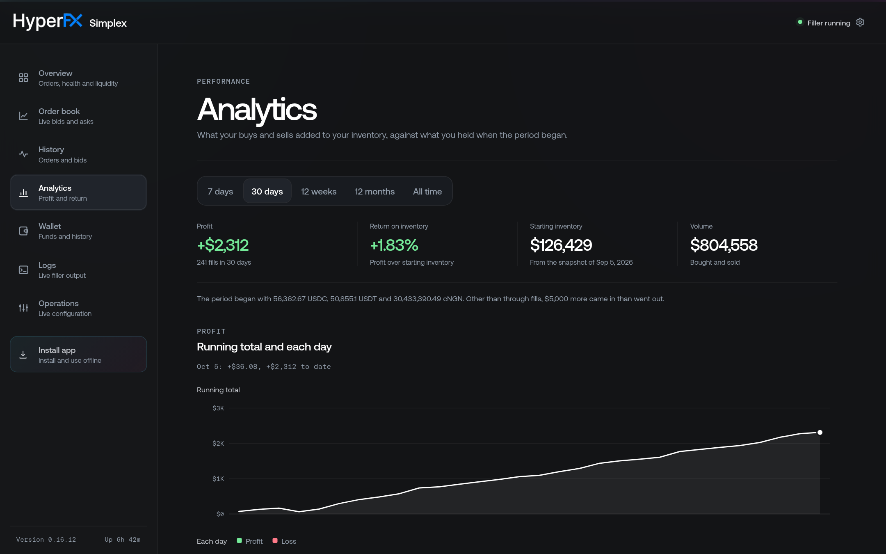
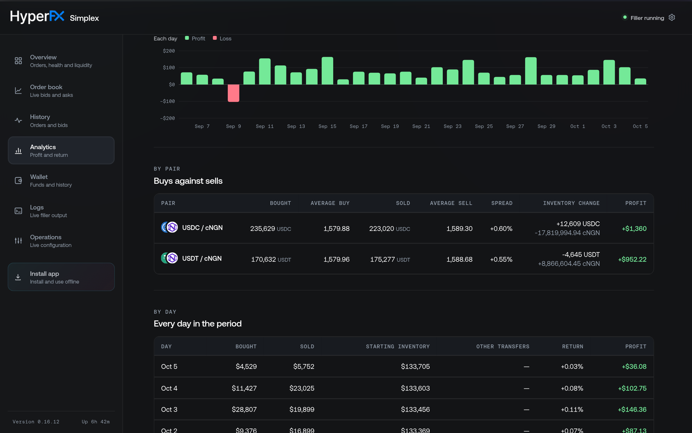

# Profitability

A solver earns by buying a token a little under the rate it sells it at. Simplex works out what that came to from the fills of your [limit orders](/developers/evm/simplex/limit-orders), compares it with the inventory you started with, and shows it in two places on the [dashboard](/developers/evm/simplex/dashboard).

## The 7-day return

The **Overview** page shows one figure, **7-day return**, beside your liquidity. It is what your buys and sells added to your inventory over the last seven days, as a percentage of the inventory you held when those seven days began. It is green when your inventory grew and red when it shrank, with the dollars underneath.

The figure is a dash when there is nothing to compare, and the line underneath says why: no fills yet, or no record of what you held at the start.

Click the figure to open the Analytics page.

## The Analytics page

<figure style={{ display: 'flex', flexDirection: 'column', alignItems: 'center' }}>

<figcaption>Thirty days of fills: the profit, the return on inventory, the inventory the period began with, and the volume traded.</figcaption>
</figure>

Pick a period at the top. Each one is cut into buckets of its own size:

| Period | Bucket |
|---|---|
| **7 days**, **30 days** | Day |
| **12 weeks** | Week, starting on Monday |
| **12 months** | Month |
| **All time** | Year, from your first fill |

Days start at midnight on your own clock, not at UTC.

The four figures under it cover the whole period:

| Figure | What it shows |
|---|---|
| **Profit** | What the period's buys and sells added to your inventory, less what they took out of it, in dollars. |
| **Return on inventory** | That profit as a percentage of the starting inventory. |
| **Starting inventory** | The dollar value of everything the solver held when the period began, and where that figure came from. The line under the figures lists the tokens. |
| **Volume** | The dollars bought plus the dollars sold. |

Two charts follow, on the same time axis. **Running total** is the profit to date at the end of each bucket. Under it, each bucket's own profit is a bar, green above the line for a gain and red below it for a loss. Point at a bucket in either chart to read both of its figures out above them.

<figure style={{ display: 'flex', flexDirection: 'column', alignItems: 'center' }}>

<figcaption>One loss among thirty days, then the same period by pair and by day.</figcaption>
</figure>

**By pair** sets your buys against your sells on each pair: how much you bought and sold, the average rate of each, the spread between those averages, what the fills did to the two tokens you hold, and the profit.

The last table lists every bucket in the period, latest first, with the inventory each one began with and its own return.

## How profit is counted

Every fill takes one token in and pays another out. Added up token by token, the period's fills are what the period did to your inventory, and the dollar value of that change is your profit.

- Buying 100 USDC at 1,580 cNGN and selling 100 USDC at 1,590 leaves your USDC where it was and your cNGN up by 1,000. That 1,000 cNGN is the profit.
- Buying 200 USDC and selling only 100 leaves you 100 USDC up and some cNGN down. Both changes count: the profit is what the extra USDC is worth, less what the missing cNGN is worth.

Each token is valued at one rate throughout, the pair's latest: midway between its latest buy and its latest sell. So volume you bought and have not yet sold counts at that rate, and a past figure moves a little when the rate does.

A few things are deliberately left out:

- **Network fees are not counted.** Neither the gas your fills paid nor the fees an order carried are part of these figures.
- **Tokens with no dollar price are left out of the dollar figures.** A token is priced through a pair that connects it to USDC, USDT or DAI, directly or through another token. One that no pair connects is named in the note under the tables.

## The starting inventory

The return compares the profit with what you held when the period began: every token in the solver's wallet and its [vaults](/developers/evm/simplex/treasury), on every chain, at the same latest rates.

A blockchain can say what an account holds now but not what it held last month, so Simplex keeps its own record:

- **A daily snapshot.** Once a day the solver stores what it holds. A period uses the snapshot nearest its start, adjusted by the fills and sends between the two, however far apart they are.
- **Today's balances, for the last seven days.** Simplex can also take what you hold now and undo the fills and sends since. It does this only for a period that began within the last seven days, and only when no snapshot is nearer.

A deposit from outside appears on no record, so it counts as if you had held it all along. The nearer a record is to the period's start, the less of that there can be.

<Callout type="info">
    Snapshots begin when you upgrade to the release that added this page: the first is taken on the
    solver's first complete balance read. A period that began before it uses that first snapshot,
    with the fills and sends before it undone.
</Callout>

<Callout type="info">
    Simplex began recording what each fill took in with the same release. Older fills are priced at
    their order's own rate instead, which is the least they could have taken in. The note under the
    tables says how many fills in the period are priced this way.
</Callout>

## From the API

The same figures are available from [`GET /api/analytics/profitability`](/developers/evm/simplex/api/limit-orders#get-apianalyticsprofitability), for a spreadsheet or your own monitoring.
