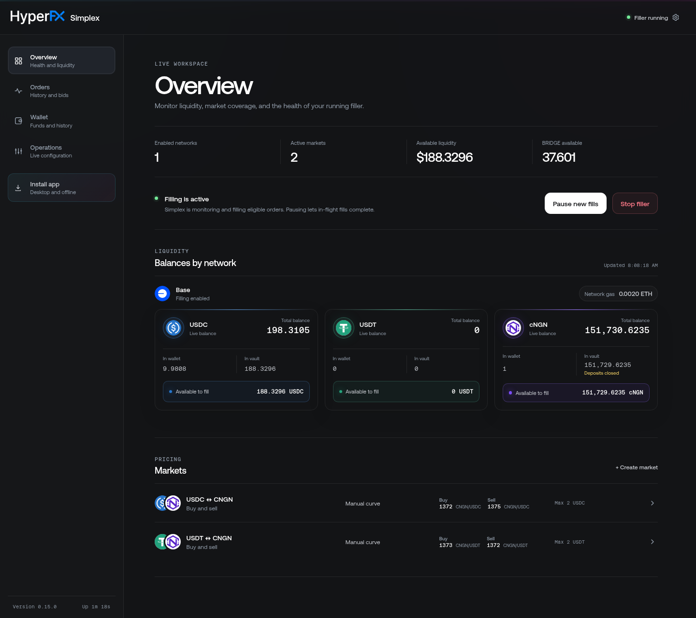
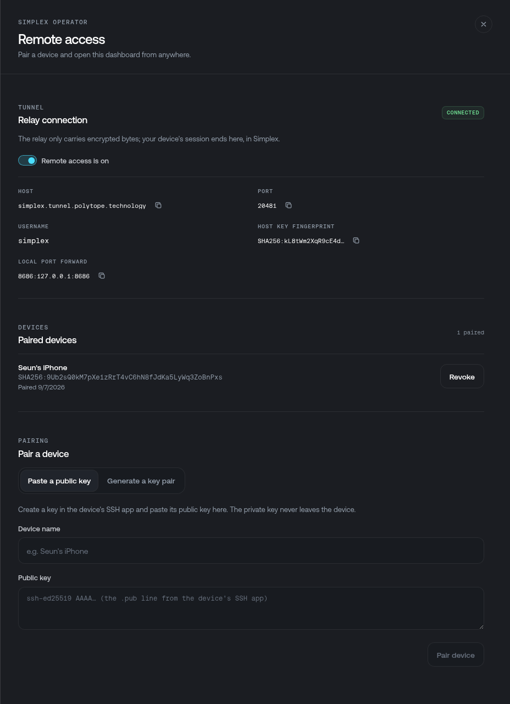

# Accessing the dashboard

The dashboard is where a running solver is watched and steered: balances per chain, the markets it quotes, price curves edited live, order history, and the treasury tools.

<figure style={{ display: 'flex', flexDirection: 'column', alignItems: 'center' }}>



<figcaption>The Overview page: liquidity per chain and per token, the filling switch, and every market the solver quotes.</figcaption>
</figure>

It is unauthenticated by design — the bind address is the boundary. It defaults to `127.0.0.1:8686`, so only the machine running the solver can reach it, and it refuses any request whose `Host` header is a DNS name rather than a loopback literal, which closes the DNS-rebinding path into it. Move it with `--ui`, or turn it off with `--no-ui` — see [Command-line flags](#command-line-flags) below.

<Callout type="warn">
    Anyone who reaches the dashboard can pause filling, edit price curves, move treasury funds and
    send tokens out of the wallet. Do not bind it to a public interface, and do not publish its
    Docker port past `127.0.0.1`. The two options below reach it from elsewhere without exposing it.
</Callout>

## On the machine running Simplex

Open `http://localhost:8686`. That is the whole setup for a solver running on your own machine — the UI is already listening when the filler starts.

## Command-line flags

The bind address is set on `simplex run`, which is the default command (`simplex` and `simplex run` are the same thing):

| Flag | Default | What it does |
|---|---|---|
| `--ui <[host:]port>` | `127.0.0.1:8686` | Where the dashboard listens. A bare number keeps the host at `127.0.0.1`, so `--ui 9000` means `127.0.0.1:9000`. |
| `--no-ui` | off | Runs the filler headless — no dashboard, no port. |
| `-c, --config <path>` | `./filler-config.toml`, then `$SIMPLEX_HOME/config.toml` | The TOML config. When neither exists, `run` starts the browser setup wizard instead of the filler. |
| `-d, --data-dir <path>` | `./.simplex-data` | Bid database, runtime state, and the tunnel's keys under `tunnel/`. |
| `--watch-only` | off | Watches and prices orders without filling them. |

```bash lineNumbers
simplex run --ui 9000                  # 127.0.0.1:9000
simplex run --ui 192.168.1.50:8686     # one LAN interface
simplex run --ui 0.0.0.0:8686          # every interface — see the warning above
simplex run --no-ui                    # headless
```

A port outside 1–65535 is not fatal: Simplex logs the bad value and falls back to `127.0.0.1:8686`. A port already in use is handled differently on each side of the split — the **setup wizard** retries on an ephemeral port and prints the URL it actually got, while a **running filler** treats the filler as the workload and the dashboard as the optional part: it logs `UI server failed to start` and carries on filling without a UI.

Two guards ride along with the bind, and neither is configurable:

- **The setup wizard only binds loopback.** It collects private keys, so a non-loopback `--ui` is refused outright — unless Simplex is running in a container, where the network namespace is the boundary and the published port is what matters.
- **Requests must carry an IP `Host` header.** A DNS name is refused, which closes DNS rebinding. Bound to loopback, the `Host` must itself be a loopback literal (or `localhost`); bound anywhere else, any IP literal is accepted.

### Under Docker

The image fixes the binary as its entrypoint and passes `run --data-dir /data --ui 0.0.0.0:8686` as the default command. The container binds every interface **inside its own network namespace** — Docker Desktop on macOS and Windows runs the daemon in a VM and offers no `--network host`, and loopback inside the container would be unreachable — so the published port is what keeps the dashboard private. Keep the `127.0.0.1:` prefix:

```bash lineNumbers
-p 127.0.0.1:8686:8686
```

Arguments after the image name replace that default command, so pass the whole list when you change one part of it:

```bash lineNumbers
docker run -d --name simplex --restart unless-stopped \
    -p 127.0.0.1:9000:9000 \
    -v simplex-data:/data \
    polytopelabs/simplex:latest \
    run --data-dir /data --ui 0.0.0.0:9000
```

Changing the container's own port means changing both halves — the `--ui` port and the right half of `-p`. Leaving `--ui` at `8686` and publishing `-p 127.0.0.1:9000:8686` works too, and moves only the port you browse to.

## Over SSH port forwarding

On a VPS, a home server, or any host you are not sitting at, the dashboard is still bound to that machine's loopback. This section and the next reach it from elsewhere, and neither opens a port to the internet.

If you already have SSH access to the host, forward the port. Nothing in Simplex changes:

```bash lineNumbers
ssh -N -L 8686:127.0.0.1:8686 operator@your-server
```

Open `http://localhost:8686` on your own machine while that session is up. The traffic rides inside SSH, and the dashboard stays on the server's loopback.

This works from a tablet or phone too, with any SSH client that does local port forwarding: Blink or Termius on iOS, ConnectBot or JuiceSSH on Android. Point the forward at the same `8686:127.0.0.1:8686`, connect, then open `http://localhost:8686` in the device's browser.

It needs a reachable SSH server, so it is the right choice for a host with a public address and the wrong one for a machine behind NAT.

## Through the remote access tunnel

Simplex can open an **outbound** SSH tunnel to a rendezvous relay, which leases it a stable public port. The host needs no public IP, no inbound port, and no `sshd` — useful for a solver running on a laptop or a box behind NAT.

```toml lineNumbers
[simplex.tunnel]
enabled = true
# relay        = "simplex.tunnel.polytope.technology:443"  # the default, hosted by Polytope
# relayHostKey = "SHA256:..."                              # pin a self-hosted relay
```

It is off unless `enabled = true`, and it only runs once the solver is up — never while the setup wizard holds private keys. A tunnel failure is retried with backoff and never affects filling.

The relay never sees your dashboard traffic. Your device's SSH session terminates inside Simplex, in an embedded SSH server that accepts only paired device keys and only a port forward to the UI: no shell, no command execution, no other destination. The relay just moves the encrypted bytes between the two.

### Pairing a device

Open **Operations → Remote access** in the dashboard and turn it on.

<figure style={{ display: 'flex', flexDirection: 'column', alignItems: 'center' }}>



<figcaption>The Remote access panel: the tunnel switch, everything an SSH app needs to connect, the paired devices, and the pairing form.</figcaption>
</figure>

Create a key in the device's SSH app, then paste its public key with a name — the private key never leaves the device. For apps that cannot generate keys, Simplex can generate the pair and show the private key once, with a QR code. The panel then lists everything the SSH app needs: host, port, username, host key fingerprint, and the local port forward.

In the SSH app, save a connection to that host and port, add the local forward, accept the host key after checking it against the fingerprint shown, and open `http://localhost:8686` in the device's browser.

<Callout type="warn">
    A paired device key opens the whole dashboard, Send and the treasury tools included. Keep it on
    the device rather than in a key store that syncs to a cloud, and revoke it from the same panel
    if the device is lost — revocation takes effect immediately.
</Callout>

Keys live under `<data-dir>/tunnel/` in plain OpenSSH formats: the operator key that identifies this solver to the relay, the host key your devices pin, and `authorized_keys` for the paired devices. The relay is [open source](https://github.com/polytope-labs/simplex-tunnel) if you would rather run your own; point `relay` at it and pin its fingerprint with `relayHostKey`.
