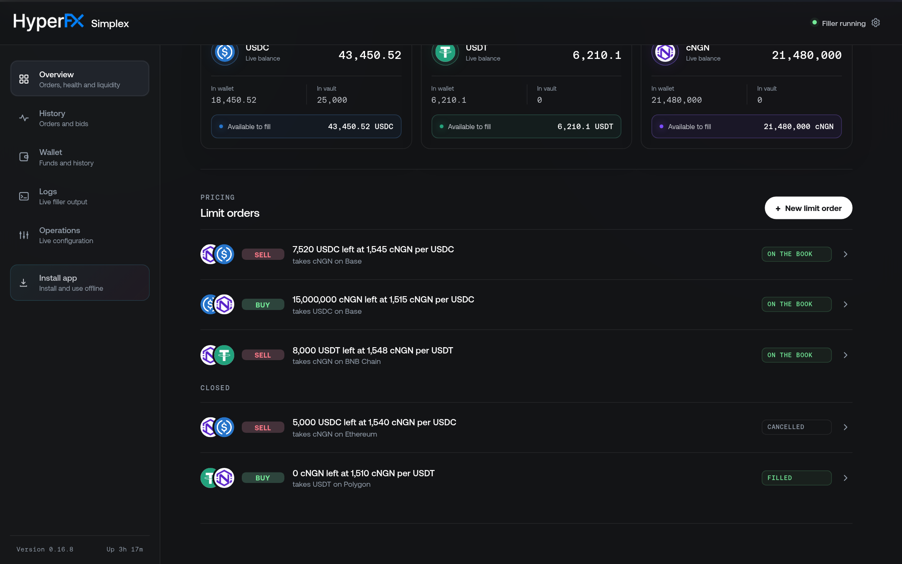
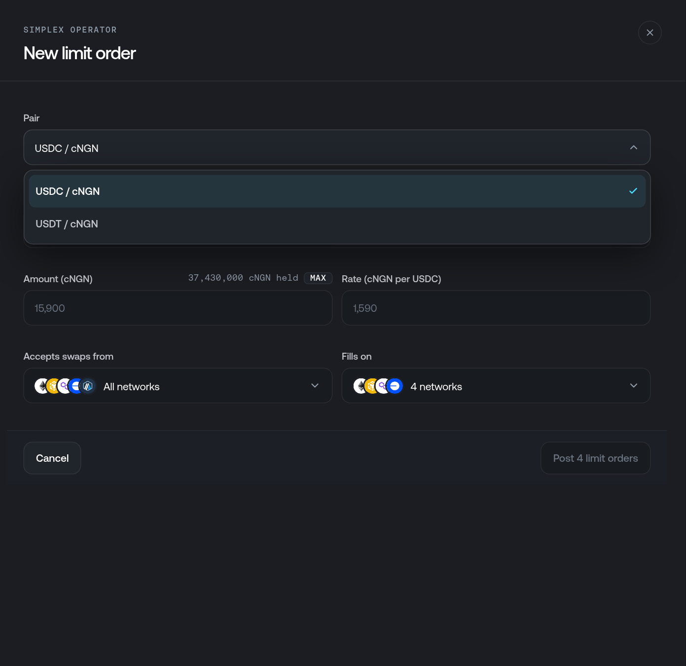
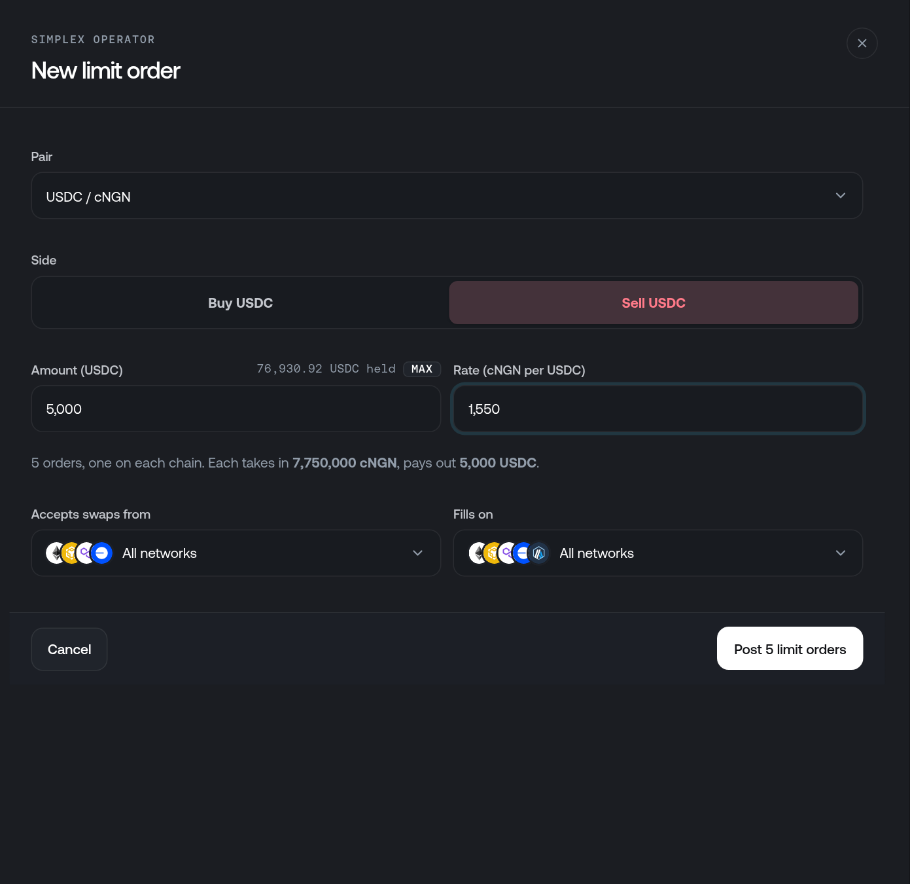
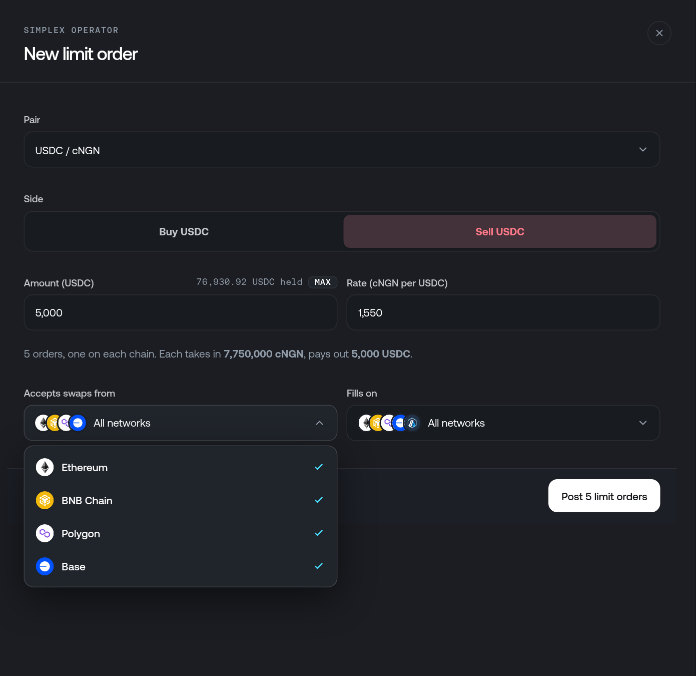
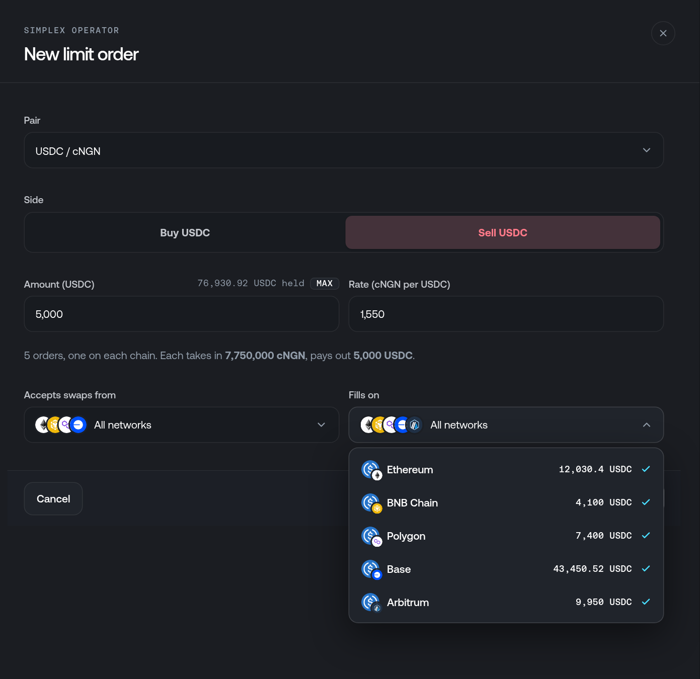
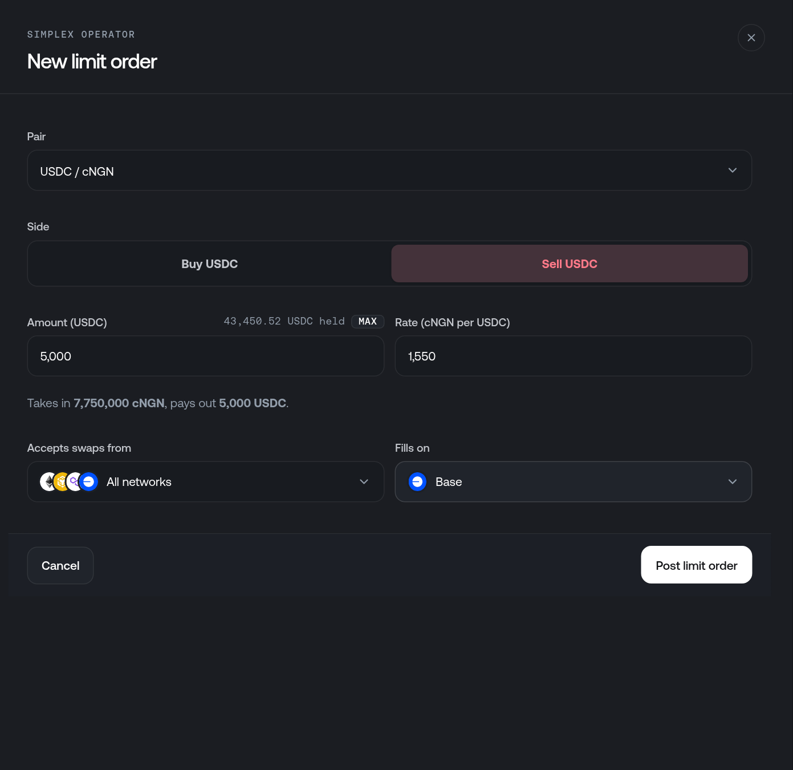
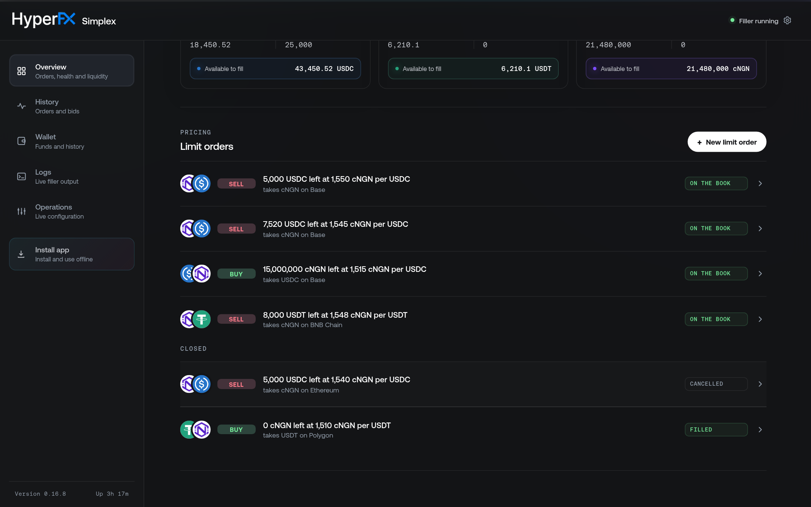
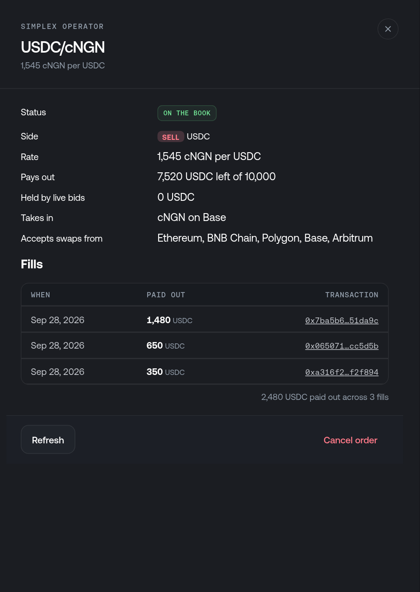
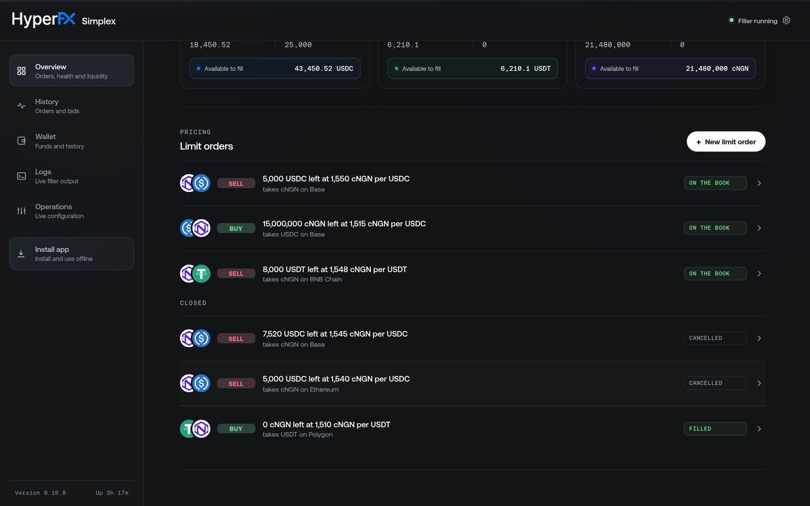

# Limit orders

Simplex has no prices of its own. You set them by posting **limit orders**. Each one is a standing offer: _on this chain, I will pay out up to this much of one token, at this rate, for another token_. Simplex advertises every open order on the [HyperFX orderbook](https://hyperfx.finance), where swappers are quoted against it. It fills an incoming swap only when one of your orders covers it. If none does, it has no fallback price and the swap is skipped.

A limit order goes in one direction. An order that sells USDC for cNGN prices cNGN-to-USDC swaps only, and is never turned around to buy USDC at the inverse rate. To make a two-sided market, post one order on each side. You can hold as many orders as you like, across any pairs and chains.

Limit orders live in the solver's database (`bids.db` in the data directory), not in `filler-config.toml`. You create and cancel them while the filler runs, and they survive restarts.

## Before you start

- The filler is running, and its `[orderbook]` section points at the orderbook for your network. The setup wizard writes this section for you. See [Configuration](/developers/evm/simplex/configuration#orderbook).
- The chain you want to fill on holds the token the order pays out. Simplex refuses an order that the wallet and the [treasury vaults](/developers/evm/simplex/treasury) on that chain cannot cover.

Limit orders are on the **Overview** page of the [dashboard](/developers/evm/simplex/dashboard), under **Pricing**, below the balances.

<figure style={{ display: 'flex', flexDirection: 'column', alignItems: 'center' }}>



<figcaption>Live orders sit at the top and closed ones under their own heading. Each row shows the side, what is left, the rate, the token taken in, the fill chain and the status.</figcaption>
</figure>

## Creating a limit order

Click **New limit order**. The form asks for a pair, a side, an amount and a rate. Simplex works out both token amounts from those, so you never do the arithmetic yourself.

<Steps>
<Step>
### Choose the pair

The **Pair** menu lists only the books the orderbook keeps, such as `USDC / cNGN` and `USDT / cNGN`. The orderbook refuses any other pair. Every book is quoted as _quote per base_. For `USDC / cNGN`, USDC is the base and cNGN is the quote.

<figure style={{ display: 'flex', flexDirection: 'column', alignItems: 'center' }}>



<figcaption>Only the orderbook's own books can be picked.</figcaption>
</figure>
</Step>

<Step>
### Pick a side, then state the amount and rate

The side is always relative to the book's base:

| Side | Simplex takes in | Simplex pays out | Fills swaps from |
|---|---|---|---|
| **Buy USDC** | USDC | cNGN | USDC to cNGN |
| **Sell USDC** | cNGN | USDC | cNGN to USDC |

**Amount** is how much of the paid-out token the order offers: cNGN when buying, USDC when selling. The label beside it shows how much of that token is held across the chains selected under **Fills on**. **Max** fills in the whole balance.

**Rate** is in quote per base, such as `1,550` cNGN per USDC. A higher rate works in your favour when you sell the base, and a lower rate when you buy it. Keep your sell rate above your buy rate. The gap between them is your spread.

When both fields are filled in, the line below them shows the two amounts the order will be posted with. The amount taken in is rounded up, so the posted order never gives the swapper a better price than the rate you entered.

<figure style={{ display: 'flex', flexDirection: 'column', alignItems: 'center' }}>



<figcaption>Selling 5,000 USDC at 1,550 cNGN per USDC takes in 7,750,000 cNGN.</figcaption>
</figure>

Changing the pair or the side clears the amount, because the amount is in whichever token is paid out.
</Step>

<Step>
### Choose which source chains to accept

**Accepts swaps from** lists the chains a swap may start on. By default, every chain the filler watches is selected, except those where the orderbook does not list the token being taken in. In the example above, Arbitrum is not offered, because the orderbook does not list cNGN on Arbitrum. A swap that starts on the fill chain itself is always accepted. At least one chain must be selected.

<figure style={{ display: 'flex', flexDirection: 'column', alignItems: 'center' }}>



<figcaption>Deselect a source chain to stop taking cross-chain swaps from it.</figcaption>
</figure>
</Step>

<Step>
### Choose the fill chains

**Fills on** is where Simplex pays out. The menu shows how much of the paid-out token each chain holds. By default, every chain holding some of that token is selected.

<figure style={{ display: 'flex', flexDirection: 'column', alignItems: 'center' }}>



<figcaption>Each chain shows its balance of the token the order pays out.</figcaption>
</figure>

An order pays out on one chain only. If you select several chains, the form posts **one order per chain**, each with the full amount, and the button changes to **Post N limit orders**. To offer 5,000 USDC in total instead of 5,000 on each chain, select one chain, or post separate smaller orders.

<figure style={{ display: 'flex', flexDirection: 'column', alignItems: 'center' }}>



<figcaption>One fill chain means one order. The summary line and the button both reflect that.</figcaption>
</figure>
</Step>

<Step>
### Post it

Click **Post limit order**. Simplex checks the order before storing it:

- **The chain can pay it out.** The wallet balance plus the treasury vault positions for that token on the fill chain must cover the amount. The check uses the whole balance, not whatever is left after your other orders. One balance backs every order that rests on it, and the orderbook advertises each order at the lower of its size and your balance. Whichever order fills first reduces what the others can offer.
- **It is above the dust floor.** The orderbook has a minimum size for each token. An amount below it is refused, with the minimum named in the error.
- **The pair, tokens and chains are ones the orderbook serves.** The orderbook must list the token being taken in on every accepted source chain.
- **The solver account is delegated on the fill chain.** If it is not, Simplex sets up the delegation first and refuses the order only if that fails.

If any check fails, the form shows why and nothing is posted. If you are posting to several chains and one fails partway through, the form tells you which chains succeeded and deselects them, so that retrying does not post them again.

The new order appears in the list straight away. It shows **Posting** until the orderbook accepts it, then **On the book**.

<figure style={{ display: 'flex', flexDirection: 'column', alignItems: 'center' }}>



<figcaption>The new order at the top of the live list, on the book on Base.</figcaption>
</figure>
</Step>
</Steps>

An order created from the dashboard lives for `[orderbook] defaultTtlSecs`, which is one year by default. That is its whole life: nothing renews it. When it runs out, Simplex withdraws the order and marks it **Expired**. Post a new one if you still want to offer that depth.

## Managing limit orders

### Reading the list

The list refreshes every 10 seconds, because orders fill, resize and expire without you doing anything. Each row reads as the offer it makes, such as `7,520 USDC left at 1,545 cNGN per USDC`, followed by the token taken in and the fill chain. The **Buy** or **Sell** tag is green or red, so you can see the side at a glance.

The status badge shows whether the order is actually working:

| Badge | Meaning |
|---|---|
| **On the book** (green) | Posted and live on the orderbook. |
| **Posting** (amber) | Stored, but the orderbook has not accepted it yet. |
| **On the book** (amber) | Still open, but the last posting or check reported a problem. Open the order to see the reason. Simplex retries on its next cycle. |
| **Resizing** (amber) | A fill is being settled and the order is being reposted at its new size. |
| **Filled** | Everything has been paid out. If an order is closed with a small amount left, that amount was below the orderbook's dust floor. |
| **Cancelled** | You cancelled it. |
| **Expired** | Its TTL ran out. |
| **Refused** | The orderbook rejected the posting. The reason is shown on the order. |

An amber **On the book** that reads `UNDER_FUNDED` means your balance no longer covers the order, so the orderbook is advertising less than the order's size. Top up the fill chain or cancel the order. Reposting it would only get it cut down again.

### Opening an order

Click a row to see its details and the fills that drew it down.

<figure style={{ display: 'flex', flexDirection: 'column', alignItems: 'center' }}>



<figcaption>The fills explain why an order has shrunk: 10,000 USDC less 2,480 paid out across three fills leaves 7,520.</figcaption>
</figure>

| Field | What it shows |
|---|---|
| **Rate** | The rate you set, in quote per base. |
| **Pays out** | What is left of the order, out of its original size. |
| **Held by live bids** | Output promised to bids that have neither filled nor been retracted. |
| **Takes in** | The input token, and the chain the order fills on. |
| **Accepts swaps from** | The source chains the order accepts. |
| **Fills** | Each fill: when it happened, how much it paid out, and a link to the transaction on the fill chain's explorer. |

**Refresh** reloads the details. If the orderbook refused the last posting, the error appears above the fills.

### Cancelling an order

Open the order and click **Cancel order**. Simplex withdraws the order from the orderbook and moves it under **Closed**. Bids already placed against it can still settle. Cancelling stops new bids, not ones already in flight.

<figure style={{ display: 'flex', flexDirection: 'column', alignItems: 'center' }}>



<figcaption>The cancelled order moves to the Closed list and keeps its history.</figcaption>
</figure>

You cannot edit an order. To change its rate or size, cancel it and post a new one.

## How orders are matched and filled

When a swap arrives, Simplex checks it against every open limit order. An order can serve the swap only if all of these are true:

1. It fills on the swap's destination chain.
2. It takes in the token the swapper is paying, and pays out the token they want.
3. For a cross-chain swap, the source chain is one the order accepts.
4. At its rate, the order would pay at least what the swapper asked for.
5. It has something left to pay out.

**No match, no fill.** When no order serves a swap, the log explains why at `info` level: `No limit order matches this order`, with a `reason` naming the check that the closest order failed. That might be no open orders, the wrong destination chain, the wrong tokens, a source chain not accepted, the rate (`it asks for X; the best limit order offers Y`), or depth.

**Simplex bids at your rate.** Each bid offers everything the order would pay for the swapper's input at its rate, capped at what the order has left. The gateway credits the swapper what they asked for, and splits anything above that between the swapper and the protocol. A better rate therefore reaches the swapper, and bids from competing solvers are ranked by price. Your margin is the rate you set.

**Several orders can fill one swap.** If more than one order can serve a swap, Simplex sends one bid per order, best rate first. The IntentGateway clamps each fill to what the swap still needs, so the swap is never paid out twice. If the best order cannot cover the whole swap, the others can supply the rest.

**Every bid must still be profitable.** Rate is not the only test. A matched order is also skipped when any of the following is true:

- `order.fees` do not cover the fill's gas, plus the relayer fee for a cross-chain fill. The relayer fee pays for delivering the escrow-release message back to the source chain, roughly 1M gas priced on that chain. Your rate's margin never counts toward this.
- A same-asset transfer, such as USDC to USDC across chains, would not leave the solver with more of the asset than it sent.
- The wallet on the fill chain cannot cover the payout and the dispatch fee, even after withdrawing from [treasury vaults](/developers/evm/simplex/treasury).

The log names which check failed: `No profitable strategy found for order` means the order was priced, but at a loss.

**Partial fills.** If your matching orders cannot cover a whole swap, Simplex fills what they can. The gateway releases escrow in proportion to the output delivered. This works for same-chain and cross-chain orders. A partial fill collects no `order.fees`, because those go only to whoever completes the order, so partial fills are exempt from the fee check. Your rate's margin pays for their gas. Two kinds of order are never partially filled: orders carrying output calldata, which the gateway runs only on a full fill, and orders another solver has already partially filled.

**Multi-leg orders** are priced leg by leg. A bid on only some of the legs is a partial fill, with the same limits.

**A fill resizes the order.** When a fill lands, Simplex reduces the order by what was actually delivered, releases whatever that bid was holding, and reposts the order at its new size. When what is left drops below the orderbook's dust floor, the order closes as **Filled**.

**A pending bid does not block the next one.** Each bid holds its payout against its order until it settles. The next bid is still sized from the order's full remaining amount. So if several pending bids win at once, fills can briefly pay out more than the order's size, up to what the wallet holds.

<Callout type="info">
    Simplex keeps the orderbook in sync on its own. It sends heartbeats so your postings stay live, withdraws expired orders every 30 seconds, and reconciles against the orderbook every `reconcileIntervalSecs` (5 minutes by default). Reconciliation reposts any order the orderbook has lost and cancels any entry that no longer has an order. If the orderbook is unreachable when Simplex starts, filling still works, because Simplex prices from its local copy of your orders.
</Callout>

## Example: a two-sided USDC/cNGN market

To buy and sell cNGN on Base with a 30 cNGN spread, post two orders:

| Order | Side | Amount | Rate | Result |
|---|---|---|---|---|
| 1 | **Sell USDC** | 10,000 (USDC) | 1,545 | Pays up to 10,000 USDC to swappers selling cNGN, taking 1,545 cNGN per USDC. |
| 2 | **Buy USDC** | 15,000,000 (cNGN) | 1,515 | Pays up to 15,000,000 cNGN to swappers selling USDC, at 1,515 cNGN per USDC. |

Filling both sides in equal volume earns 30 cNGN per USDC. To lean into one side, post only that order, or give the other one less depth. That is the equivalent of a one-sided LP.

## Managing limit orders over the HTTP API

Everything the dashboard does with limit orders goes through a small HTTP API on the solver, and you can call it directly: from a script, a cron job, or a pricing bot that reprices from a market feed. The API is served on the same address as the dashboard (`127.0.0.1:8686` by default) and has the same trust boundary. It has no authentication of its own, so keep it on loopback and reach it remotely only as described in [Accessing the dashboard](/developers/evm/simplex/dashboard).

| Method | Route | What it does |
|---|---|---|
| `GET` | `/api/orderbook/books` | The books, minimum sizes and per-chain tokens the orderbook serves |
| `POST` | `/api/limit-orders` | Create a limit order and post it to the orderbook |
| `GET` | `/api/limit-orders` | List limit orders, newest first |
| `GET` | `/api/limit-orders/:id` | One order, with its fills and pending bids |
| `DELETE` | `/api/limit-orders/:id` | Cancel an order and withdraw it from the orderbook |

A few rules apply to every call:

- **Mutating requests need `X-Simplex-UI: 1`.** `POST` and `DELETE` without this header get `403`. It stops a web page in your browser from posting to the API behind your back.
- **The `Host` must be an IP address**, such as `127.0.0.1`, or `localhost` on a loopback bind. A DNS name is refused.
- **The filler must be running.** While the setup wizard is open, every route answers `409 Filler is not running`.
- **Errors are JSON** in the form `{ "error": "..." }`. `400` means the request was refused, and the message says why. `404` means no such order. `502` means the orderbook could not be reached.

The examples below use a shell variable for the base URL:

```bash lineNumbers
SIMPLEX=http://127.0.0.1:8686
# With --ui-socket, pass the socket to curl instead:
#   curl --unix-socket "$HOME/.simplex-runtime/ui.sock" http://localhost/api/limit-orders
```

### Step 1: find a book

A limit order can name only a book the orderbook lists, and its tokens must be registered on the chains involved:

```bash lineNumbers
curl -s $SIMPLEX/api/orderbook/books
```

```json lineNumbers
{
  "books": [
    { "id": "USDC-cNGN", "base": "USDC", "quote": "cNGN" },
    { "id": "USDT-cNGN", "base": "USDT", "quote": "cNGN" }
  ],
  "minOrderSizes": [ { "symbol": "USDC", "size": "..." } ],
  "chains": [
    { "id": "EVM-8453", "name": "Base",
      "tokens": [ { "symbol": "USDC", "decimals": 6 }, { "symbol": "cNGN", "decimals": 6 } ] }
  ]
}
```

`minOrderSizes` is the dust floor for each token. The amount an order pays out must be at least that size, which is 1e18-scaled here. `chains` lists the tokens the orderbook registers on each chain. An order's input token must be registered on every chain it accepts swaps from.

### Step 2: create an order

The API does not take a side and a rate like the dashboard form. Instead, you state what Simplex takes in and what it pays out. The side and rate follow from those two amounts:

```bash lineNumbers
# Sell 5,000 USDC on Base at 1,550 cNGN per USDC:
# take in 5,000 × 1,550 = 7,750,000 cNGN, pay out 5,000 USDC.
curl -s -X POST $SIMPLEX/api/limit-orders \
    -H 'Content-Type: application/json' -H 'X-Simplex-UI: 1' \
    -d '{
          "fillChain": "EVM-8453",
          "tokenIn": "cNGN",  "amountIn": "7750000",
          "tokenOut": "USDC", "amountOut": "5000",
          "acceptedSources": ["EVM-1", "EVM-56", "EVM-137", "EVM-8453"]
        }'
```

| Field | Required | Description |
|---|---|---|
| `fillChain` | yes | State machine ID of the chain Simplex pays out on, such as `"EVM-8453"`. Must be a chain in your config that the orderbook serves. |
| `tokenIn` | yes | Symbol Simplex takes in. Case-insensitive, so `CNGN` and `cNGN` both work. |
| `amountIn` | yes | Whole tokens taken in, as a decimal string, such as `"7750000"` or `"1500.25"`. At most 18 decimal places. |
| `tokenOut` | yes | Symbol Simplex pays out. |
| `amountOut` | yes | Whole tokens paid out, as a decimal string. This is the order's size. |
| `acceptedSources` | yes | Source chains to accept swaps from. Must be non-empty, with no repeats, and every chain must be served by the orderbook with `tokenIn` registered. |
| `ttlSecs` | no | The order's lifetime in seconds. Defaults to `[orderbook] defaultTtlSecs` (one year). Must meet the orderbook's minimum TTL. |

`tokenIn` and `tokenOut` together pick the book. When `tokenIn` is the book's base, the order is a **Buy** (a `BID`). When `tokenIn` is the quote, it is a **Sell** (an `ASK`). The rate is always stored as quote per base, and it is rounded so that it is never better for the swapper than your two amounts imply. To go from a rate you have in mind to the two amounts:

| You want to | `tokenIn` | `amountIn` | `tokenOut` | `amountOut` |
|---|---|---|---|---|
| Buy the base at `rate`, paying `Q` quote | base | `Q ÷ rate` | quote | `Q` |
| Sell `B` base at `rate` | quote | `B × rate` | base | `B` |

Round `amountIn` up if it does not divide exactly. Rounding down would quote a slightly better rate than you meant.

The response is the stored order and the outcome of posting it:

```json lineNumbers
{
  "order": {
    "id": "9f1c2e6a-3b4d-4c1e-9a55-0d7f2b8e41aa",
    "book": "USDC-cNGN", "base": "USDC", "quote": "cNGN", "side": "ASK",
    "fillChain": "EVM-8453",
    "price":     "1550000000000000000000",
    "size":      "5000000000000000000000",
    "remaining": "5000000000000000000000",
    "reserved":  "0",
    "acceptedSources": ["EVM-1", "EVM-56", "EVM-137", "EVM-8453"],
    "ttlSecs": 31536000,
    "expiresAt": "2027-09-28 11:52:03",
    "status": "open",
    "commitment": "0x…",
    "lastError": null,
    "createdAt": "2026-09-28 11:52:03",
    "updatedAt": "2026-09-28 11:52:04"
  },
  "result": { "kind": "accepted", "order": { "commitment": "0x…" }, "surfaced": true }
}
```

On the order row, `price`, `size`, `remaining` and `reserved` are **1e18-scaled integers** whatever the token's own decimals, so `"5000000000000000000000"` is 5,000 USDC. The request takes whole tokens, but the stored rows are scaled. Divide by 10¹⁸ to read them. `size` and `remaining` are in the token paid out.

`result.kind` says what the orderbook did with the order:

| `kind` | Meaning |
|---|---|
| `accepted` | On the book. `surfaced: false` means the orderbook has your solver suspended, and Simplex sends a heartbeat straight away to bring it back. |
| `unchanged` | The orderbook already held this exact posting. |
| `rejected` | The orderbook refused it. The order's `status` is `rejected`, and `code` and `message` say why. |
| `failed` | The request did not get through. The order stays `open` with `lastError` set, and reconciliation posts it again. |
| `unposted` | A same-asset order (see below). Stored and used for matching, but not advertised. |

A `400` means nothing was stored. The message names the problem, such as an amount that is not a plain decimal, an unserved chain or token, an amount below the dust floor, or a balance that cannot cover the order:

```json lineNumbers
{ "error": "The wallet holds 1000 in the wallet and 200 in vaults USDC on EVM-8453, which cannot pay out 1500" }
```

To offer the same size on several chains, send one request per `fillChain`, as the dashboard does.

### Step 3: watch it

List orders, optionally filtered by `status` (`open`, `resizing`, `filled`, `cancelled`, `expired`, `rejected`), fill `chain`, or `book`:

```bash lineNumbers
curl -s "$SIMPLEX/api/limit-orders?status=open&chain=EVM-8453&book=USDC-cNGN"
# → { "orders": [ { "id": "...", "status": "open", "remaining": "...", ... } ] }
```

Read one order with the fills that drew it down and the bids that have not settled yet:

```bash lineNumbers
curl -s $SIMPLEX/api/limit-orders/9f1c2e6a-3b4d-4c1e-9a55-0d7f2b8e41aa
```

```json lineNumbers
{
  "order": { "id": "9f1c2e6a-…", "status": "open", "remaining": "3520000000000000000000", "…": "…" },
  "fills": [
    { "id": 12, "commitment": "0x…", "amount": "1480000000000000000000",
      "transactionHash": "0x…", "filledAt": "2026-09-28 12:20:41" }
  ],
  "bids": []
}
```

Fills are newest first, and `amount` is 1e18-scaled in the token paid out. An order with no commitment and a `lastError` has not reached the book. Read `lastError` to see why. The [status badges](#reading-the-list) above map directly onto `status`, `commitment` and `lastError`.

### Step 4: cancel it

```bash lineNumbers
curl -s -X DELETE -H 'X-Simplex-UI: 1' $SIMPLEX/api/limit-orders/9f1c2e6a-3b4d-4c1e-9a55-0d7f2b8e41aa
# → { "order": { "status": "cancelled", ... }, "result": { "kind": "cancelled", "commitment": "0x…" } }
```

The order is closed locally first, so nothing new can draw on it even if the orderbook call fails. If `result.kind` is `rejected` or `failed`, the entry may still be live on the orderbook. Simplex keeps its commitment on the row, and the next reconciliation withdraws it.

There is no update route. To reprice, cancel the order and create a new one:

```bash lineNumbers
#!/usr/bin/env bash
# Reprice a USDC sell order on Base from a new rate: cancel, then re-create.
set -euo pipefail
SIMPLEX=http://127.0.0.1:8686
RATE=$1          # cNGN per USDC, such as 1560
SIZE=5000        # USDC to offer

for id in $(curl -s "$SIMPLEX/api/limit-orders?status=open&chain=EVM-8453&book=USDC-cNGN" \
            | jq -r '.orders[] | select(.side == "ASK") | .id'); do
    curl -s -X DELETE -H 'X-Simplex-UI: 1' "$SIMPLEX/api/limit-orders/$id" > /dev/null
done

curl -s -X POST "$SIMPLEX/api/limit-orders" \
    -H 'Content-Type: application/json' -H 'X-Simplex-UI: 1' \
    -d "$(jq -n --arg in "$(echo "$SIZE * $RATE" | bc)" --arg out "$SIZE" '{
          fillChain: "EVM-8453", tokenIn: "cNGN", amountIn: $in,
          tokenOut: "USDC", amountOut: $out,
          acceptedSources: ["EVM-1", "EVM-56", "EVM-137", "EVM-8453"] }')" \
    | jq '{id: .order.id, status: .order.status, posted: .result.kind}'
```

Between the cancel and the new posting there is a short gap with no ask on the book. If that matters to you, create the new order first, then cancel the old one. Both orders are checked against the same balance, so the balance only needs to cover the larger of the two.

### Same-asset quotes

The API can create an order that takes in and pays out the **same** token, such as USDC in on any source chain and USDC out on Base, for cross-chain transfers. The dashboard form cannot. The orderbook lists no such books, so this order is never advertised. It is stored (`result.kind: "unposted"`) and matched against incoming same-asset swaps like any other order. It must pay out no more than it takes in. The shortfall below par is your spread:

```bash lineNumbers
# Pay out up to 10,000 USDC on Base, taking in 10,005 USDC for it (5 bps).
curl -s -X POST $SIMPLEX/api/limit-orders \
    -H 'Content-Type: application/json' -H 'X-Simplex-UI: 1' \
    -d '{ "fillChain": "EVM-8453",
          "tokenIn": "USDC", "amountIn": "10005",
          "tokenOut": "USDC", "amountOut": "10000",
          "acceptedSources": ["EVM-1", "EVM-42161", "EVM-137"] }'
```

To embed Simplex as a library rather than run the binary, the same operations are available as `simplex.limitOrders.books()`, `create()`, `list()`, `get()`, `withFills()` and `cancel()`. They emit `limit-order:posted`, `limit-order:rejected`, `limit-order:cancelled`, `limit-order:resized` and `limit-order:filled` events. See the [Simplex SDK guide](/developers/sdk/simplex).
