# Pricing from a pool

Curves are not the only way to price a pair. When you hold Uniswap V4 liquidity for the exotic token, Simplex can read the price off the pool and withdraw from the position to fund a fill.

## Uniswap V4 LP funding

<Callout type="info">
This is the **Uniswap V4 LP** funding source, configured under `[vault.uniswapV4]`. It funds (and prices) the **exotic** token from concentrated-liquidity positions. It is distinct from the [`[vault]` stablecoin treasury](/developers/evm/simplex/treasury#vault-treasury-erc-4626) (ERC-4626), which sources **stablecoins** — the two share the `[vault]` section.
</Callout>

When the solver's wallet balance on the destination chain is insufficient to fill an order, Simplex can automatically withdraw liquidity from on-chain positions to cover the deficit. Withdrawal calls are prepended to the UserOperation as ERC-7821 batch calls, making the funding atomic with the fill.

Configured under the top-level `[vault.uniswapV4]` block. Decreases liquidity from concentrated Uniswap V4 positions via PositionManager NFTs. Slippage tolerance is set by `spreadBps` (default 50 bps / 0.50%), deadline defaults to the order's deadline. Each position needs a `chain` and a `tokenId` (the ERC-721 position NFT ID); pool details are read on-chain at startup.

```toml lineNumbers
[vault.uniswapV4]
positions = [
    { chain = "EVM-8453", tokenId = "123456789" },
]
```

<Callout type="info">
Vaults are initialized at startup; on-demand **refresh** runs before each withdrawal plan so calculations use current on-chain reserves. Simplex can aggregate withdrawals across multiple vaults if needed.
</Callout>

To find your `tokenId`, open your position on the Uniswap V4 app — the token ID is the number in the URL (e.g. `app.uniswap.org/positions/v4/8453/2087350` → `tokenId = "2087350"`).

<figure style={{ display: 'flex', flexDirection: 'column', alignItems: 'center' }}>



<figcaption>Copy the token ID from your Uniswap V4 NFT position page to use as the <code>tokenId</code> in your vault config.</figcaption>
</figure>

## Pool-Based Pricing

When **`[vault.uniswapV4]`** lists at least one position, cross-asset pairs without curves derive bid/ask prices from **Uniswap V4 pool state** (current tick). The pool acts as the price oracle instead of a static curve. Note this yields a **single** price used in both directions — a venue-priced pair has no bid/ask spread of its own, so its margin comes from `order.fees` alone.

With Uniswap V4 positions configured, you can **omit** `bidPriceCurve` and `askPriceCurve` on the pair. Pool pricing requires the pair's `token0` to be a USD stablecoin, and same-token pairs always need their curve. The optional **`spreadBps`** field (basis points) sets the slippage tolerance for on-chain LP redemptions; defaults to `50` (0.50%).

Uniswap V4 venue pricing uses pools that pair the exotic token with **USDC or USDT** (addresses from your chain config). When multiple positions exist for the same exotic token on a chain, the most-liquid qualifying pool's price is used.

```toml lineNumbers
[assets.CNGN]
"EVM-8453" = "0x46C85152bFe9f96829aA94755D9f915F9B10EF5F"

[[pairs]]
token0 = "USDC"
token1 = "CNGN"
maxOrderSize = "5000"       # no curves — priced from the pool

[vault.uniswapV4]
spreadBps = 50  # 0.5% slippage tolerance on LP redemptions
positions = [
    { chain = "EVM-8453", tokenId = "2087350" },
]
```

<Callout type="info">
Startup validation requires a pricing source per pair: **either** bid/ask price curves, **or** at least one `[vault.uniswapV4]` position. A pair with neither fails validation.
</Callout>

## Uniswap price guards

Pool-based pricing trusts the live pool, which leaves the solver exposed to a manipulated, stale, or thin pool returning a bad quote. To bound that risk, give a position a **`referencePrice`** and **`maxDeviationBps`**. Whenever the pool quote on that chain drifts more than `maxDeviationBps` above or below the reference, the solver refuses to fill — the order is rejected before any bid is submitted.

`referencePrice` is expressed in **exotic tokens per USD**, the same units as the bid/ask curves. The two fields must be set together; omit both to leave the chain unguarded.

```toml lineNumbers
[vault.uniswapV4]
# referencePrice is the expected cNGN per USD;
# reject if the quote is more than 2% off.
# The two go together — one without the other is rejected.
[[vault.uniswapV4.positions]]
chain           = "EVM-8453"
tokenId         = "2087350"
referencePrice  = "1575"
maxDeviationBps = 200
```

## Example profit calculation

For a \$1000 USDC → cNGN order, the curve interpolates to bid 1575, ask 1555 at the $1000 size:

```
User sends:       $1000 USDC
Solver delivers:  1,555,000 cNGN      (1000 × ask 1555)
Solver's cost:    1,555,000 / 1575    = $987.30  (valued at bid)
Spread profit:    $1000 − $987.30     = $12.70
Fee profit:       $2.80 − $1.30 costs = $1.50
Total profit:     ~$14.20
```
