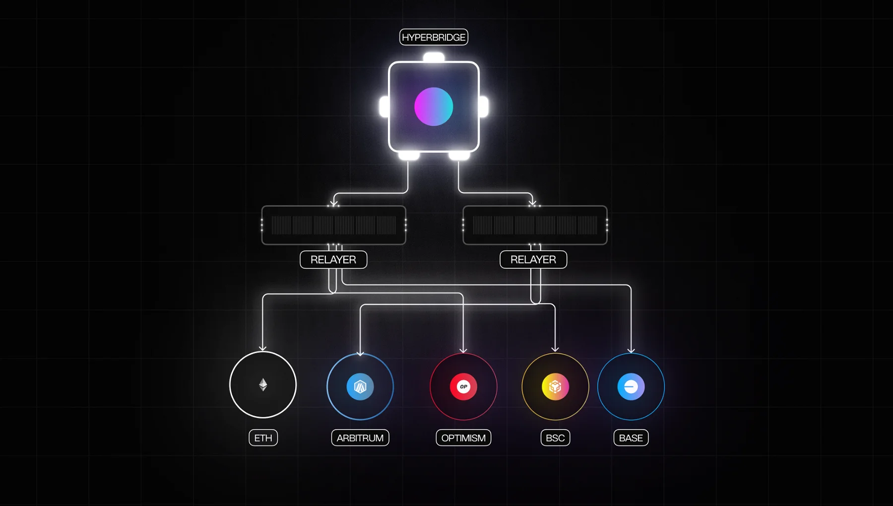

# tesseract



Tesseract is a multi-~~dimensional~~chain relayer implementation for Hyperbridge. Currently this supports relaying between:

- [x] Substrate based chains
- [x] EVM based chains

## Usage Guides

Consult the [documentation](https://docs.hyperbridge.network/network/relayer) for more information on how to use this.

## Docker Guide

Optionally build the image locally:

```bash
DOCKER_BUILDKIT=0 docker build -t tesseract .
```

Next run the relayer given a config file

```bash
docker run tesseract --config ./integration-tests/config.toml
```

Or run our pre build images:

```bash
docker run polytopelabs/tesseract:latest --config ./integration-tests/config.toml
```

## License

This software is licensed under the Apache 2.0 License, Copyright (c) 2023 Polytope Labs.

## Notes

We trace transactions in concurrently so it's necessary to increase the file open limit for the user session the process is running within.
Your rpc provider must support processing requests well above 100 requests/second

```markdown
Edit /etc/security/limits.conf and add the following using the appropriate username

@username soft nofile 100000
@username hard nofile 100000

Edit /etc/pam.d/common-session and add the following

session required pam_limits.so
```

Reboot the machine after making these changes.
